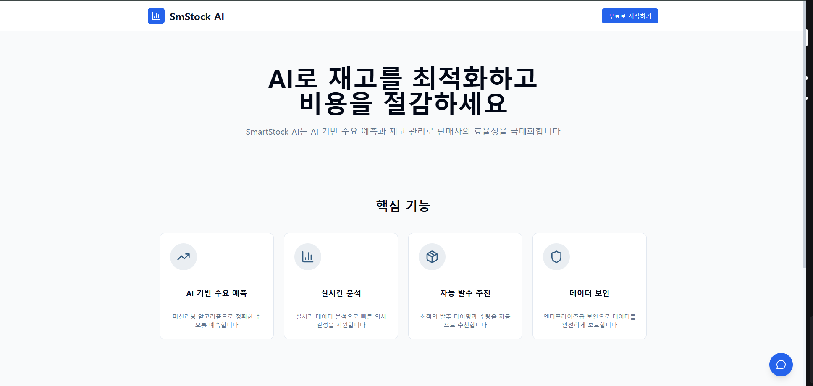
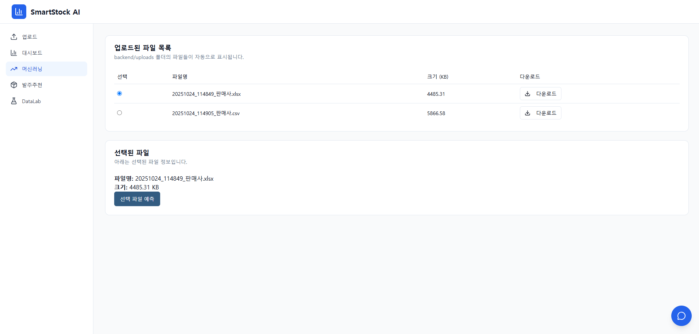
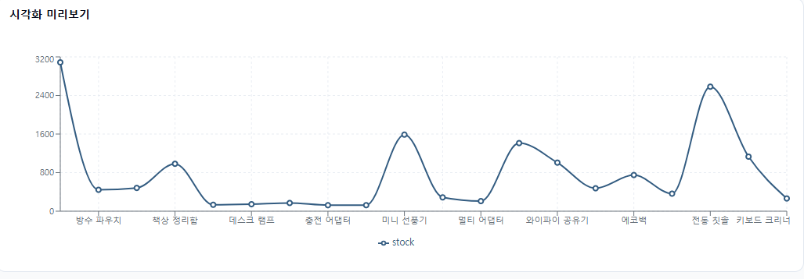
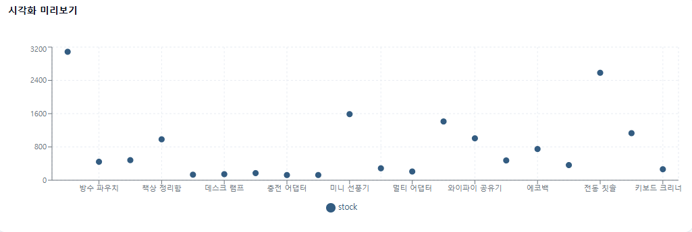
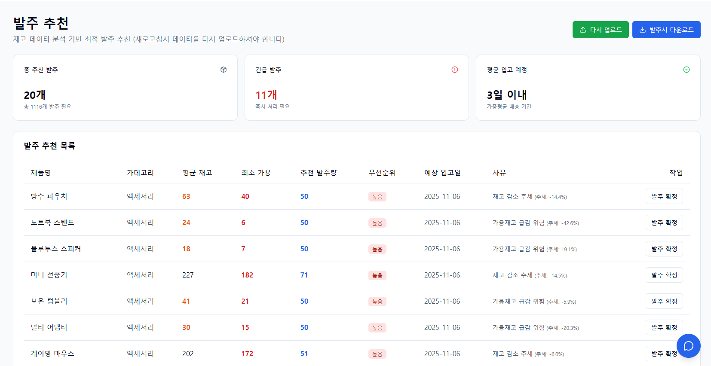

# SmartStock AI  
**“데이터 업로드 한 번으로 예측과 발주까지 자동화하는 AI 재고관리 플랫폼”**

SmartStock AI는 ERP/WMS 미보유 기업의 **재고 불일치·품절·과잉재고 문제를 AI 자동화로 해결**하기 위해 설계된 SaaS형 플랫폼입니다.  
사용자는 데이터를 업로드하기만 하면 시스템이 스스로 정제하고 예측하며, 최적 발주 정책을 제안합니다.  
FastAPI, TensorFlow, React, MySQL 기반의 구조로 데이터를 이해하고 실행 가능한 의사결정으로 전환합니다.

---

## 프로젝트 개요

| 항목 | 내용 |
|------|------|
| 프로젝트명 | SmartStock AI |
| 목적 | ERP/WMS 미보유 기업의 재고관리 비효율을 AI 예측·자동정책화로 해결 |
| 핵심 가치 | 데이터를 올리면, AI가 이해하고 발주를 제안한다 |
| 주요 기술 | FastAPI · TensorFlow · React · MySQL · MLflow · Docker |
| 개발 기간 | 2025.10.01 ~ 2025.10.30 |
| 기획 방향 | ERP/WMS 미보유 기업도 CSV·Excel 업로드만으로 데이터 정제·예측·발주 추천까지 자동화하는 **AI 기반 재고관리 SaaS 플랫폼 구축** — 데이터 기반 의사결정의 실무 적용을 목표로 함 |

---

## 서비스 구조


SmartStock AI는 단순한 모델 구현을 넘어,  
**데이터 정제부터 발주 정책까지의 전 과정을 자동화한 통합 구조**로 설계되었습니다.

| 구성요소 | 역할 |
|-----------|------|
| Frontend (React) | 파일 업로드, 데이터 시각화, Open API 질의 인터페이스 |
| Backend (FastAPI) | 데이터 정제, 예측·정책 API 제공 |
| Model Engine (TensorFlow) | LSTM+CNN 하이브리드 수요예측 모델 |
| Database (MySQL) | 예측 및 정책 결과 저장 |
| Infra (Docker + MLflow + AWS) | 모델 버전관리 및 컨테이너 기반 배포 |

---

## 서비스 흐름

SmartStock AI의 사용자 여정은 **데이터 업로드 → 예측 → 정책 계산 → 시각화 → 질의응답**의 5단계로 구성됩니다.

| 단계 | 사용자 행동 | 시스템 반응 |
|------|---------------|-------------|
| 1 | Excel/CSV 업로드 | 컬럼 자동 인식 및 결측·이상치 정제 |
| 2 | “미래예측 실행” 클릭 | LSTM+CNN 기반 SKU 단위 예측 수행 |
| 3 | “정책 계산” 클릭 | EOQ·ROP·SS 공식 기반 자동 발주정책 산출 |
| 4 | “대시보드 보기” 클릭 | Fill Rate·품절률 등 KPI 시각화 |
| 5 | Open API 질의 | GPT-4가 자연어 질의에 실시간 응답 |


---

## Dashboard Overview

SmartStock AI는 데이터를 시각화하여  
**예측 결과와 발주정책 계산 과정을 직관적으로 확인할 수 있는 대시보드 환경**을 제공합니다.

### 1️⃣ 메인 페이지  


> 서비스 소개와 ‘무료 체험 시작’ 버튼을 통해 진입합니다.  
> 데이터 업로드 → 예측 → 정책 추천의 전체 흐름을 한눈에 이해할 수 있도록 구성했습니다.

### 2️⃣ 업로드 및 예측 실행  
  
> Excel/CSV 파일 업로드 시 AI가 컬럼 구조를 자동 인식하고 결측치를 보정합니다.  

### 3️⃣ 데이터 시각화 (DataLab)  



> 예측된 데이터의 추세, 계절성, 변동성을 시각적으로 분석할 수 있습니다.  

### 4️⃣ 발주 정책 및 추천 결과  

> AI가 EOQ·ROP·SS 계산을 기반으로 **발주 순서와 사유**를 자동 표시합니다.  
> KPI 카드 및 대시보드와 연동되어 실무자가 바로 의사결정을 내릴 수 있습니다.

---

## AI 기반 데이터 처리 및 정책 계산

AI는 단순 예측을 넘어 **“실행 가능한 정책”**을 산출하도록 설계되었습니다.

- **전처리:** Linear interpolation / IQR Winsorization  
- **모델 구조:** LSTM + CNN 병렬 구조  
- **학습 입력:** 최근 14일 데이터를 기준으로 한 슬라이딩 윈도우  
- **정책 계산 공식:**
SS = z × σ_demand × √L
ROP = μ_demand × L + SS
Q = max(0, ROP + 목표재고 − 현재가용재고)

yaml
코드 복사

| 지표 | 목표 | 결과 |
|------|------|------|
| WAPE | ≤ 15% | 14.2% |
| Fill Rate | ≥ 95% | 96.3% |
| 품절률 | ≤ 2% | 1.8% |

---

## Open API 기반 질의응답

> “이번주 B상품은 발주해야 할까?”  
> → GPT-4 Open API가 대시보드 데이터를 분석해 즉시 응답합니다.

사용자는 **자연어 질의**로 재고 상태, 예측 결과, 발주 정책의 근거를 조회할 수 있습니다.  
현재는 시뮬레이션 형태의 프로토타입이며,  
향후 데이터 기반의 **Copilot형 질의응답 기능**으로 확장될 예정입니다.

---

## 성과 및 사용자 가치

| 항목 | 결과 | 의미 |
|------|------|------|
| WAPE 14.2% | 예측 정확도 향상 | SKU 단위 수요 대응 |
| Fill Rate 96.3% | 재고가용성 향상 | 품절·과잉재고 감소 |
| 업무시간 70% 단축 | Excel 대비 | 발주·입고 의사결정 자동화 |
| UX 단순화 | 클릭 3회 내 프로세스 완성 | 비전문가 접근성 향상 |

---

## 발전 방향

| 개선 항목 | 접근 방식 | 기대효과 |
|------------|-------------|-----------|
| Copilot 고도화 | GPT-4o + 데이터 grounding | 실시간 질의응답 강화 |
| Cross-SKU 예측 | Transformer / TFT | 상품군 단위 상관분석 반영 |
| Auto Retraining | Airflow + MLflow | 자동 재학습 파이프라인 구축 |
| SaaS 전환 | Multi-Tenant 구조 | 중소기업형 구독 서비스화 |

```

## 폴더 구조

SmartStock-AI/
┣ backend/
┣ frontend/
┣ images/
┃ ┣ mainpage_hero.png
┃ ┣ upload_forecast_page.png
┃ ┣ datalab_bar_chart.png
┃ ┣ datalab_line_chart.png
┃ ┣ datalab_scatter_chart.png
┃ ┣ purchase_recommendation.png
┃ ┗ system_architecture.png
┣ docs/
┃ ┣ SmartStockAI_Final_Report.pdf
┃ ┣ SmartStockAI_User_Guide.pdf
┃ ┗ SmartStockAI_Planning_Doc.pdf
┗ README.md


```

## Project Documents

- [Final Report](docs/SmartStockAI_Final_Report.pdf) — 기술 및 분석 보고서  
- [User Guide](docs/SmartStockAI_User_Guide.pdf) — 대시보드 사용 가이드  
- [Planning Document](docs/SmartStockAI_Planning_Doc.pdf) — 기획 구조 및 기능 정의 문서  

---

**SmartStock AI**는  
“AI 기술이 실무의 언어로 작동하는 서비스”를 목표로 설계된  
AI 기반 재고예측·발주정책 자동화 플랫폼입니다.  
기술보다 사용자가 AI를 이해하고 활용할 수 있는 **실무 중심 구조 설계**에 초점을 두었습니다.
